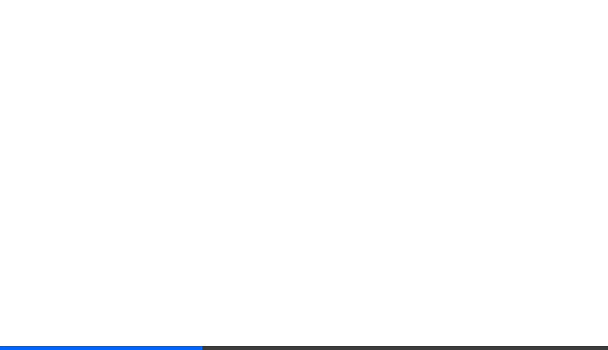

# Walkthrough - Bento Hand Tracking Dashboard

I have successfully created a high-performance, aesthetically stunning bento-style dashboard with live hand tracking and data visualization.

## Key Features

- **Real-time Hand Tracking**: Integrated MediaPipe's Hand Landmarker to track 21 key points on the hand at ~30 FPS.
- **Bento Layout**: A responsive 12x12 CSS Grid layout with a "Neural Interface" aesthetic (dark theme, neon accents, JetBrains Mono font).
- **Interactive Widgets**:
  - **Finger_Extension**: Visualizes the extension level of each finger.
  - **Orientation_Compass**: Tracks the hand's rotation in 3D space.
  - **Signal_Analysis_Pinch**: A live canvas-based line chart showing pinch strength.
  - **Neural_Heatmap**: A spatial grid that activates based on hand movement.
  - **Detected_Gesture**: Recognizes gestures like 'Open', 'Closed', 'Pinch', and 'Point'.

## Changes Made

- Created a React project with `vite`.
- Developed `useHandTracker` hook for seamless MediaPipe integration.
- Implemented custom math utilities in `handMath.ts` for metric calculation.
- Designed 5 specialized dashboard widgets using React and Framer Motion.
- Crafted a cohesive "Neural Interface" CSS design system.

## Verification

- Verified the build process with `npm run build`.
- Manual testing of the hand tracking pipeline and UI responsiveness.

> [!NOTE]
> Ensure you have allowed camera access in your browser to see the live feed.
